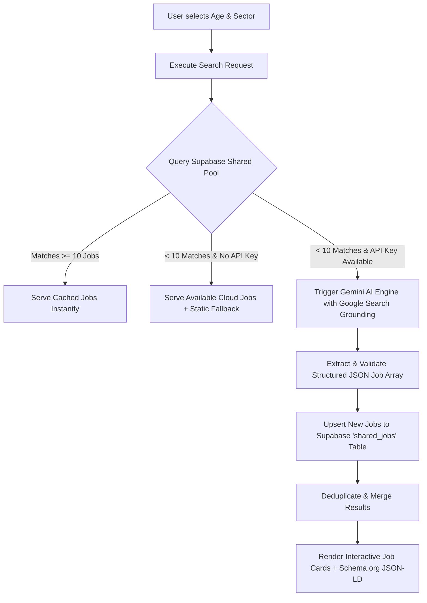

# 🇮🇳 IndiaJobFinder

> **Instant, real-time AI-powered Indian recruitment discovery platform with age-based eligibility verification, Google Search Grounding, and shared cloud caching.**

[](https://india-job-finder.vercel.app/)
[](https://react.dev/)
[](https://www.typescriptlang.org/)
[](https://vitejs.dev/)
[](https://ai.google.dev/)
[](https://supabase.com/)
[](LICENSE)

---

## 📌 Overview

**IndiaJobFinder** is a modern web platform engineered to eliminate friction, clutter, and outdated information in Indian job hunting. Traditional Indian job portals are plagued with expired listings, aggressive ad redirects, and confusing eligibility criteria. 

IndiaJobFinder addresses this by combining **Google Gemini AI with Live Google Search Grounding** and a **Supabase PostgreSQL shared pool**. Candidates can filter verified government (Sarkari) and private sector jobs based on their exact age, sector preference, and real-time active status — with direct links to official notification PDFs and application forms.

---

## 🌟 Key Features

- ⚡ **Real-Time Gemini AI Web Scanner**: Uses the Google GenAI SDK (`gemini-3-flash-preview` / `gemini-2.5-flash`) equipped with Google Search Grounding to extract active, verified Indian recruitment notices with valid future deadlines.
- 🎯 **Age-Based Eligibility Filtering**: Instantly filters openings based on the user's current age (16–60), matching requirements against official minimum and maximum age criteria.
- 🏛️ **Multi-Sector Coverage**:
  - **Government (Sarkari)**: UPSC, SSC, Banking (IBPS/SBI), Railways (RRB), State PSCs (UPPSC, BPSC, WBPSC), Defense (Agniveer, Police), and Teaching (CTET/TET).
  - **Private Sector**: Off-campus fresher tech drives, private banking (HDFC/ICICI/Axis), remote work opportunities, and corporate openings.
- ☁️ **Hybrid Cloud Architecture (Zero Quota Exhaustion)**:
  - **Shared Pool (Supabase)**: Live scans automatically sync to a PostgreSQL database table, allowing regular visitors to view jobs instantly without hitting API rate limits.
  - **Bring-Your-Own-Key (BYOK) Engine**: On-demand modal allows users or admins to plug in a free Google AI Studio Gemini API key to trigger instant web scans when pool results are thin.
- 📦 **Google Jobs Widget Ready (`Schema.org` JSON-LD)**: Every job card renders rich `JobPosting` microdata dynamically, ensuring seamless indexing by Google Jobs and search engines.
- 🤖 **AI-Crawler & LLM Ready**: Includes pre-configured `llms.txt`, `robots.txt` directives for AI bots (ChatGPT, Claude, Perplexity), and dynamic `sitemap.xml`.
- 🔗 **Direct Official Portal Routing**: Bypasses intermediate clickbait ad networks by linking directly to authentic government and corporate application URLs.
- 🎨 **Sleek, Responsive UI**: Built with Tailwind CSS, featuring high-contrast typography, interactive status badges, accessible form controls, and smooth micro-interactions.

---

## 🏗️ Architecture & Data Flow



---

## 🛠️ Tech Stack

| Domain | Technology / Tool | Purpose |
|---|---|---|
| **Frontend Framework** | [React 19](https://react.dev/) (`19.2.3`) | Modern component-based reactive UI |
| **Language** | [TypeScript](https://www.typescriptlang.org/) (`~5.8.2`) | Strict type-safety across models and services |
| **Bundler & Dev Server** | [Vite 6](https://vitejs.dev/) (`^6.2.0`) | Lightning-fast HMR and optimized production bundling |
| **Styling** | [Tailwind CSS](https://tailwindcss.com/) + Inter Font | Atomic CSS design system with custom typography |
| **AI & Grounding Engine** | [@google/genai](https://www.npmjs.com/package/@google/genai) (`^1.35.0`) | Gemini Flash models + Google Search Grounding tool |
| **Database & Cloud Storage** | [Supabase](https://supabase.com/) (`@supabase/supabase-js` `^2.48.1`) | PostgreSQL storage for shared jobs cache |
| **SEO & Microdata** | Schema.org (`JobPosting`, `FAQPage`, `WebSite`) | Search engine rich snippet and Google Jobs compatibility |
| **Hosting & Deployment** | [Vercel](https://vercel.com/) | Edge hosting with SPA rewrites and caching headers |

---

## 📁 Repository Structure

```text
IndiaJobFinder/
├── components/
│   ├── Header.tsx              # Sticky navigation header with live scan status indicator
│   └── JobCard.tsx             # Job card component with Schema.org JobPosting microdata
├── lib/
│   └── supabase.ts             # Supabase client initializer with safe fallback handling
├── public/
│   ├── llms.txt                # Context summary for AI agents and LLM discovery
│   ├── logo.svg                # Application brand vector logo
│   ├── robots.txt              # Crawler access rules (Google, Bing, GPTBot, ClaudeBot)
│   └── sitemap.xml             # XML sitemap for SEO discovery
├── services/
│   └── geminiService.ts        # Gemini AI prompt orchestrator, Grounding parser & Supabase sync
├── App.tsx                     # Core application view, search state, filter forms & BYOK modal
├── CODE_OF_CONDUCT.md          # Community guidelines & code of conduct
├── CONTRIBUTING.md             # Contributor guide and pull request workflow
├── index.html                  # HTML entry with Schema.org FAQPage & Geo tags
├── index.tsx                   # React root mounting script
├── LICENSE                     # MIT open-source license
├── metadata.json               # Platform metadata & frame permissions
├── package.json                # Dependencies and project build scripts
├── tsconfig.json               # TypeScript compiler configuration
├── types.ts                    # TypeScript data models (Job, SearchFilters, GroundingSource)
├── vercel.json                 # Vercel deployment configuration & routing rules
├── vite.config.ts              # Vite configuration with environment variable injection
└── .env.example                # Example environment variables template
```

---

## 🗄️ Database Schema Setup (Supabase)

If setting up your own Supabase project, execute the following SQL in your Supabase SQL Editor:

```sql
-- Create shared_jobs table
create table public.shared_jobs (
  id bigint generated by default as identity primary key,
  title text not null,
  organization text not null,
  type text not null check (type in ('Government', 'Private')),
  location text default 'India',
  "ageMin" integer default 18,
  "ageMax" integer default 45,
  eligibility text,
  "lastDate" text,
  description text,
  "sourceUrl" text,
  created_at timestamp with time zone default timezone('utc'::text, now()) not null,
  
  -- Prevent duplicates based on job title and organization
  constraint shared_jobs_title_organization_key unique (title, organization)
);

-- Enable Row Level Security (RLS)
alter table public.shared_jobs enable row level security;

-- Allow public read access
create policy "Allow public read access"
  on public.shared_jobs
  for select
  to anon, authenticated
  using (true);

-- Allow public insert/upsert access
create policy "Allow public insert and upsert"
  on public.shared_jobs
  for insert
  to anon, authenticated
  with check (true);
```

---

## 🚀 Getting Started

### Prerequisites

- **Node.js**: v18.0.0 or higher
- **npm** (or **pnpm** / **yarn**)
- *(Optional)* [Google AI Studio API Key](https://aistudio.google.com/app/apikey) for running live web scans
- *(Optional)* [Supabase Project](https://supabase.com/) for shared cloud database caching

### Installation

1. **Clone the repository:**
   ```bash
   git clone https://github.com/Tarunjit45/IndiaJobFinder.git
   cd IndiaJobFinder
   ```

2. **Install dependencies:**
   ```bash
   npm install
   ```

3. **Configure environment variables:**
   Copy `.env.example` to `.env`:
   ```bash
   cp .env.example .env
   ```

   Fill in your API credentials:
   ```env
   GEMINI_API_KEY=your_google_gemini_api_key
   VITE_SUPABASE_URL=https://your-project.supabase.co
   VITE_SUPABASE_ANON_KEY=your_supabase_anon_key
   ```

4. **Start the development server:**
   ```bash
   npm run dev
   ```
   Open your browser at `http://localhost:3000`.

---

## ⚙️ Environment Variables

| Variable | Required | Description |
|---|---|---|
| `GEMINI_API_KEY` | Optional* | Google Gemini API key used by Vite build definition for live web search grounding. |
| `VITE_SUPABASE_URL` | Optional* | Supabase project URL for querying and upserting into the shared job pool. |
| `VITE_SUPABASE_ANON_KEY` | Optional* | Supabase anonymous API key for public client access. |

*\*Note: The application includes offline fallbacks and an in-app "Engine Config" modal allowing users to enter a Gemini API key directly in their browser (`localStorage`), meaning the app can run without build-time secrets.*

---

## 🚢 Deployment

### Deploying to Vercel

1. Push your repository to GitHub.
2. Import the project into [Vercel](https://vercel.com/).
3. In the Vercel project settings, configure the following Environment Variables:
   - `GEMINI_API_KEY`
   - `VITE_SUPABASE_URL`
   - `VITE_SUPABASE_ANON_KEY`
4. Deploy! The included `vercel.json` ensures that client-side SPA routing and static caching headers for `sitemap.xml` and `robots.txt` are applied automatically.

---

## 🗺️ Roadmap & Future Enhancements

- [x] Real-time AI scanning via Gemini Flash + Google Search Grounding
- [x] Age-based eligibility verification (16–60 years)
- [x] Cloud sync with Supabase PostgreSQL shared pool
- [x] Schema.org `JobPosting` and `FAQPage` rich snippets
- [x] Direct official notification links
- [ ] Category-based age relaxation calculator (OBC / SC / ST / PwD / EWS)
- [ ] State-wise recruitment filters (All 28 States & 8 UTs)
- [ ] Automated scheduled cron scanner to refresh database daily
- [ ] Push notifications & WhatsApp / Telegram job alert broadcasts
- [ ] Resume-to-Job matching engine using Gemini multimodal embeddings

---

## 🤝 Contributing

Contributions are warmly welcomed! To contribute:

1. Fork the repository.
2. Create your feature branch (`git checkout -b feature/AmazingFeature`).
3. Commit your changes (`git commit -m "feat: Add AmazingFeature"`).
4. Push to the branch (`git push origin feature/AmazingFeature`).
5. Open a Pull Request.

Please review our [CONTRIBUTING.md](CONTRIBUTING.md) and [CODE OF CONDUCT](CODE_OF_CONDUCT.md) before submitting.

---

## 📄 License

This project is licensed under the **MIT License** - see the [LICENSE](LICENSE) file for details.

---

## 👨‍💻 Author & Contact

**Tarunjit Biswas**  
- **Email**: [tarunjitbiswas24@gmail.com](mailto:tarunjitbiswas24@gmail.com)  
- **GitHub**: [@Tarunjit45](https://github.com/Tarunjit45)  
- **Live Project**: [IndiaJobFinder on Vercel](https://india-job-finder.vercel.app/)
